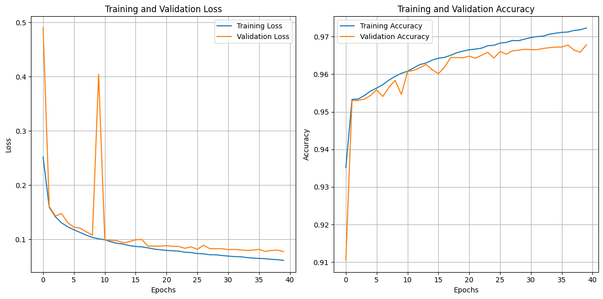

# Projeto Final

O projeto final foi dividido em duas etapas:

- Análise do dataset
- Implementação da CNN

## Análise do dataset

Foi realizada a análise de todo o dataset para verificar se o mesmo estava em condições para ser trabalhado. A análise em questão envolveu:

- Verificação da integridade dos arquivos: Verificando se todas as imagens listadas estão presentes nos arquivos.
- Consistência dos metadados: Análise detalhada para garantir que os metadados estavam precisos e consistentes.
- Qualidade das imagens: Cada imagem foi cuidadosamente inspecionada para assegurar sua eficácia no treinamento do modelo.
- Detecção de duplicatas: Foi realizada uma busca minuciosa por duplicatas que pudessem interferir no desempenho do modelo.

#### Imagens do dataset

## Implementação da CNN

#### Estrutura da CNN

#### Gráfico de perda e acurácia

### Resultados

